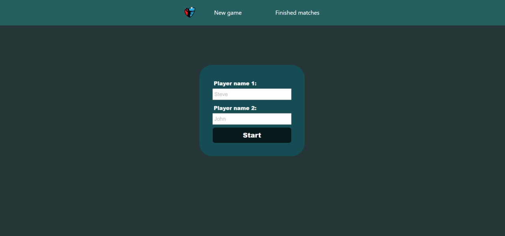
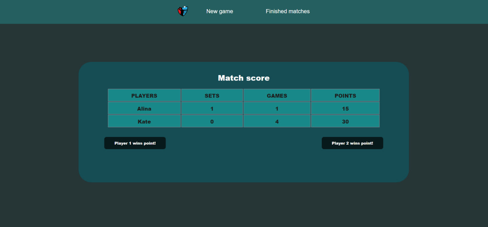
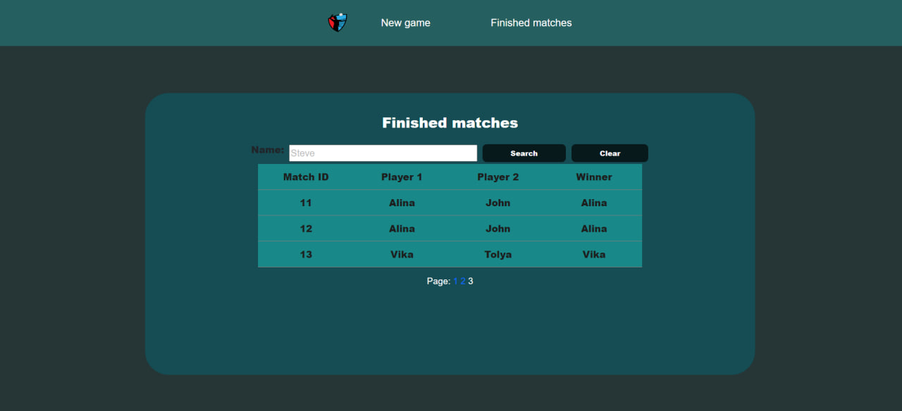

# tennis-scoreboard
http://51.20.248.214:8080/
## Инструменты

- .NET 8.0
- ASP.NET Core MVC
- Dapper
- PostgreSQL
- Docker

## Переменные окружения

| Наименование   | Стандартное значение | Описание                                                                                                                                                  |
|----------------|----------------------|-----------------------------------------------------------------------------------------------------------------------------------------------------------|
| POSTGRES_PORT  | `5432`               | порт постгрес                                                                                                                                             |
| POSTGRES_DB    | `tennis`             | название базы данных постгрес                                                                                                                             |
| POSTGRES_USER  | `postgres`           | наименование пользователя постгрес                                                                                                                        |
| POSTGRES_PASSWORD | `postgres`           | пароль пользователя постгрес                                                                                                                              |

## Функционал приложения

### Работа с матчами:

- Создание нового матча
- Просмотр законченных матчей, поиск матчей по именам игроков
- Подсчёт очков в текущем матче

## Интерфейс приложения

### Страница нового матча - /new-match

### Страница счёта матча - /match-score

### Страница сыгранных матчей - /finished-matches

